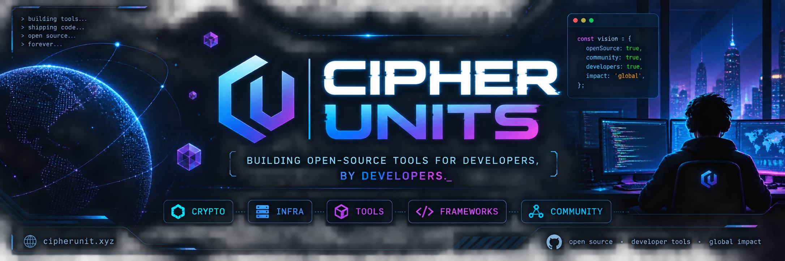

  

<h1 align="center">Cipher Units</h1>

  Building open-source tools for developers, by developers.

We're a developer collective building open-source systems, tools, and infrastructure for engineers who care about how software really works.

We focus on security, performance, reliability, and minimal design — without unnecessary complexity.

---

#### Projects

* **[CipherPortfolio](https://github.com/cipherunits/CipherPortfolio)** — Official site and a reference Next.js + TypeScript + Tailwind CSS v4 project
* **[CipherToken](https://github.com/cipherunits/CipherToken)** — High-performance token and crypto utilities in Rust, with PyO3 Python bindings
* **[CipherLogger](https://github.com/cipherunits/CipherLogger)** — See every request. Capture every error. Understand your application.
* **[CipherScope](https://github.com/cipherunits/CipherScope)** — Runtime visibility for modern applications. See what runs. Understand why.
* **[npm-mirror](https://github.com/cipherunits/npm-mirror)** — Internal npm package cache/mirror for unreliable networks
- **[fusion-framework](https://github.com/cipherunits/fusion-framework)** — One Framework, Multiple Languages, Unlimited Possibilities for modern application development
- **[fusion-tool](https://github.com/cipherunits/fusion-tool)** — A focused CLI for creating, managing, and working with Fusion projects
- **[fusion-docs](https://github.com/cipherunits/fusion-docs)** — The technical reference for understanding and building with the Fusion ecosystem
- **[fusion-snippet](https://github.com/cipherunits/fusion-snippet)** — Reusable patterns and snippets for faster, more consistent development
- **[fusion-gui](https://github.com/cipherunits/fusion-gui)** — A visual workspace for designing and managing Fusion applications

---

#### Contributing

We welcome forks, issues, and pull requests.

* [Contributing guide](https://github.com/cipherunits/.github/blob/main/CONTRIBUTING.md)
* [Code of Conduct](https://github.com/cipherunits/.github/blob/main/CODE_OF_CONDUCT.md)
* [Security policy](https://github.com/cipherunits/.github/blob/main/SECURITY.md)
* [Support](https://github.com/cipherunits/.github/blob/main/SUPPORT.md)

---

#### Links

* Website: [cipherunit.xyz](https://cipherunit.xyz)
* Contact: [cipherunit.dev@gmail.com](mailto:cipherunit.dev@gmail.com)
 
 
 

  <b><i>Made with ❤️ for developers by CipherUnit</i></b>

